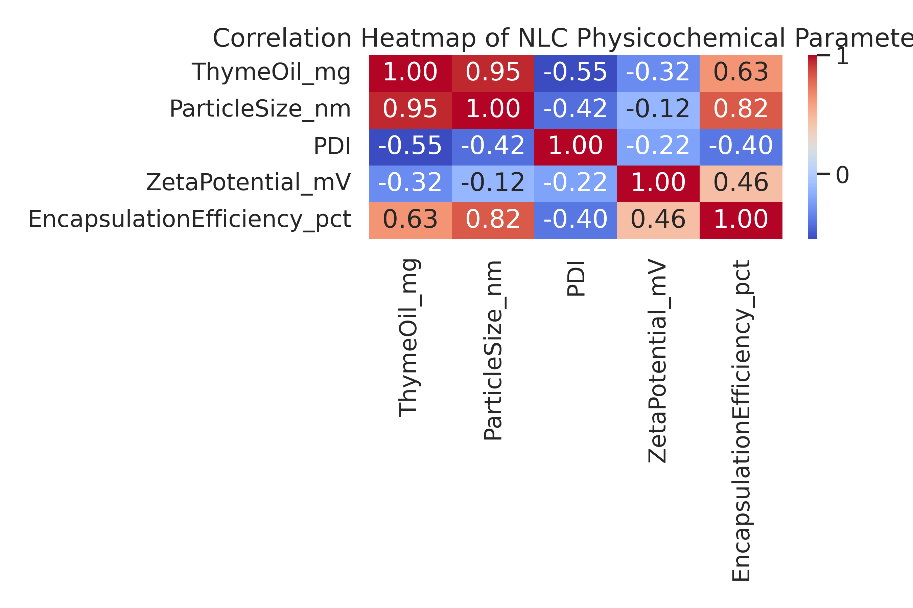
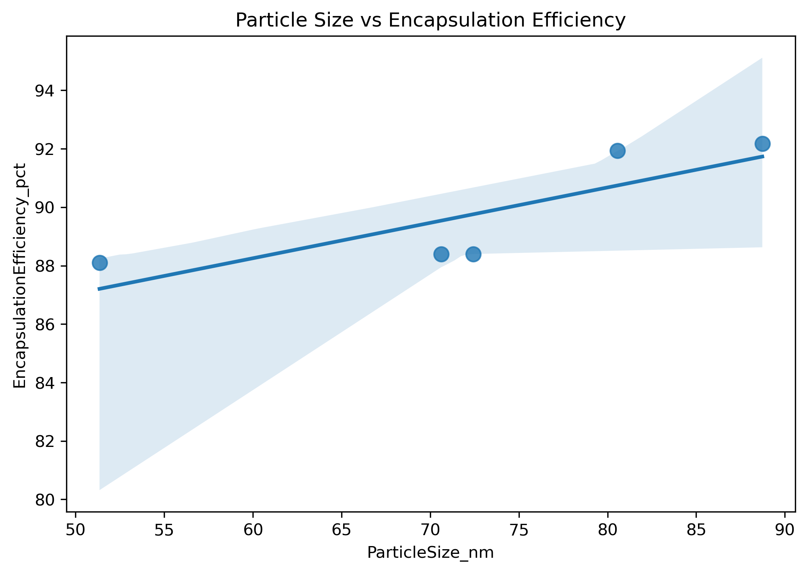
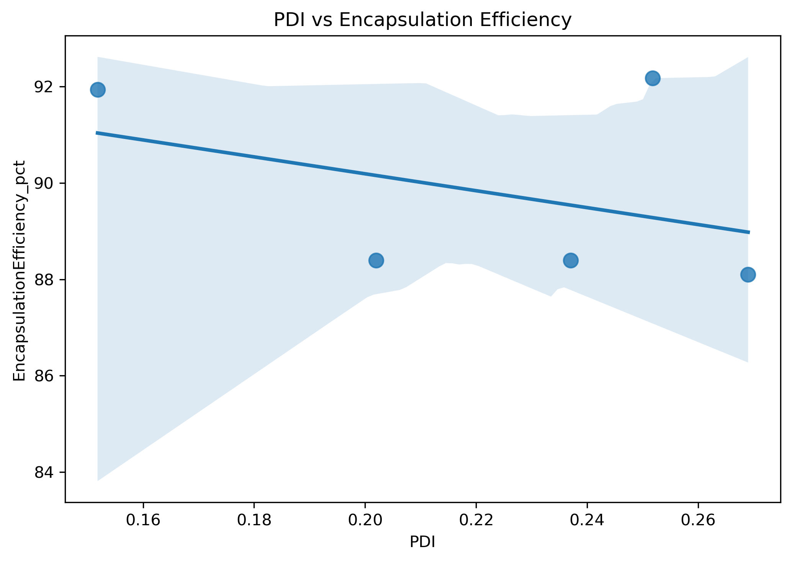

# Nanomedicine Physicochemical Visualisation using Seaborn

## Overview
This project presents an exploratory data analysis (EDA) and data visualisation workflow for **nanostructured lipid carrier (NLC)** formulations using Python and Seaborn.

The aim is to demonstrate how key physicochemical parameters of nanomedicine formulations can be analysed, visualised, and interpreted using modern data-science tools.

The dataset is derived from an **MSc research project** investigating **meropenem–thyme oil co-loaded NLCs** developed for respiratory infections, including cystic fibrosis.

---

## Dataset Description
The dataset includes commonly reported nanomedicine formulation parameters:

- **Formulation** – NLC formulation code  
- **ThymeOil_mg** – Thyme oil concentration (mg)  
- **ParticleSize_nm** – Mean particle size (nm)  
- **PDI** – Polydispersity index  
- **ZetaPotential_mV** – Zeta potential (mV)  
- **EncapsulationEfficiency_pct** – Encapsulation efficiency (%)  

The data are stored in:nlc_data.csv

---

## Methods
The analysis workflow includes:

- Data loading and inspection using **pandas**
- Descriptive statistics
- Correlation analysis
- Physicochemical visualisation using **Seaborn** and **Matplotlib**

A correlation heatmap was generated to explore relationships between formulation variables.

## Correlation Analysis

### 1. Correlation Heatmap

---

### 2. Particle Size vs Encapsulation Efficiency

---

### 3. PDI vs Encapsulation Efficiency

---

### 3. PDI vs Encapsulation Efficiency

## Key Findings
- Thyme oil concentration shows a **strong positive correlation** with particle size, indicating lipid matrix expansion with increasing oil content.
- Encapsulation efficiency correlates positively with particle size and negatively with PDI.
- Lower PDI values (more monodisperse systems) are associated with improved drug entrapment.
- These trends are consistent with reported behaviour of lipid-based nanocarriers.

---

## Repository Structure:
├── nlc_seaborn_eda.ipynb
├── nlc_data.csv
├── correlation_heatmap.png
└── README.md

---

## Tools & Libraries
- Python  
- pandas  
- seaborn  
- matplotlib  

---
 Author
Dr Ali Ahmad  
MSc Clinical & Molecular Microbiology  
MSc Drug Discovery & Development  

---

## License
This project is shared for academic, educational, and portfolio demonstration purposes.
